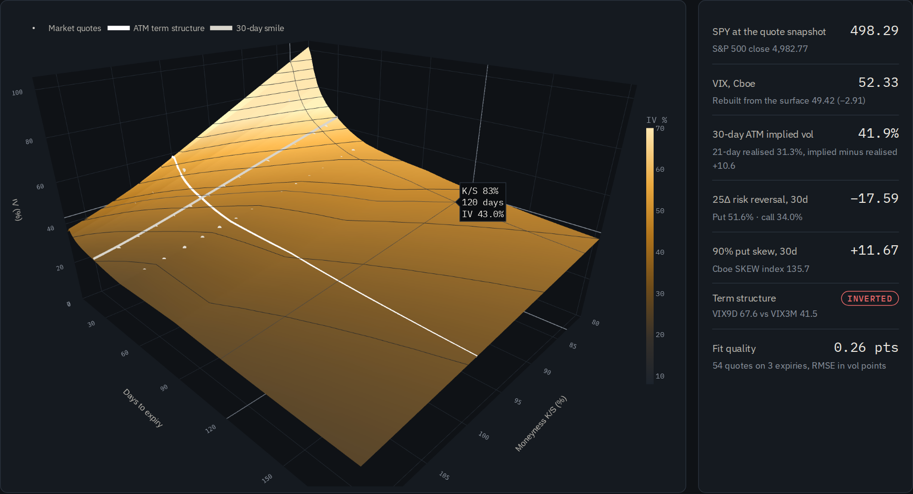
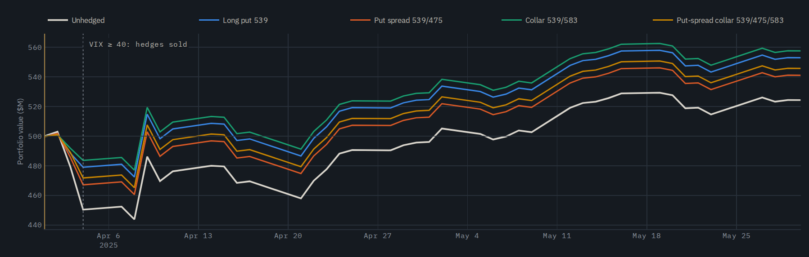
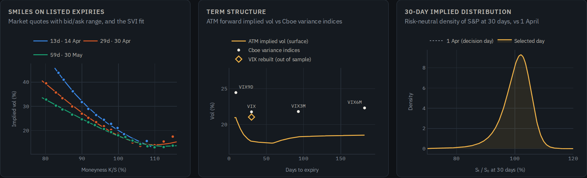

# S&P 500 Hedging Analysis: Volatility Surface and Collar Pricing

**Author:** Alessandro Radice · M.Sc. Economics and Business Law (Finance), Università Cattolica del Sacro Cuore, Milan

**Live page:** [alessandroradice.github.io/SP500-hedging-analysis](https://alessandroradice.github.io/SP500-hedging-analysis/)

**1 April 2025, after the close. A $500M US equity book, beta 1. Reciprocal tariffs are announced the next day at 4pm. Do we hedge, with which structure, and at what cost?**

An equity derivatives case study built on real market data. It rebuilds the S&P 500 implied volatility surface every trading day from January to June 2025 from **real SPY option quotes (bid and ask)**, fits an **arbitrage-free SVI** smile to each expiry, and checks the result against the **Cboe VIX, which the fit never sees**. The surface then prices four hedges on 1 April at the real quotes and marks them every day through the crash, the 90-day tariff pause and expiry on 30 May. The main output is an **interactive web page with an animated 3D volatility surface**. It comes with a Colab notebook, an **Excel hedge pricer with live formulas**, an investment memo and a presentation deck.



---

## Objective

A volatility surface is the object every options desk prices from. This project builds one from raw quotes and then uses it to answer a portfolio question:

1. **Build the surface properly.** Clean quotes, infer the underlying and the forwards, compute implied vols, fit SVI per expiry and join the expiries without static arbitrage.
2. **Prove it is right.** Rebuild the 30-day VIX from the surface out of sample, and audit butterfly and calendar arbitrage on the whole interpolated surface.
3. **Use it for a decision.** Say whether protection was cheap or expensive on 1 April, price four structures, and follow them day by day under two management rules.

---

## Key results

**The surface**

| Check | Result |
|---|---|
| Days and quotes | 122 trading days (2 Jan to 30 Jun 2025), about 51 out-of-the-money quotes a day on 3 expiries |
| Fit error | 0.47 vol points RMSE on average (median 0.41, worst day 1.16) |
| VIX rebuilt out of sample | Mean error −0.15 vol points, correlation 0.996 with the Cboe VIX; worst day 8 April (49.4 vs 52.3) |
| Butterfly arbitrage | 0 violations on 3.4 million grid points |
| Calendar arbitrage | 0.015% of grid points, all in the far call wing (beyond +17%, outside the plotted range), largest breach 4×10⁻⁵ in total variance |

**The decision on 1 April** (SPY 561.36, 8,907 contracts to cover the book, 30 May expiry)

- **Protection was not expensive.** 30-day ATM implied vol was 17.7%, below the 20.1% realised over the previous month, and the 25-delta risk reversal (−4.96) sat near its half-year median (−4.51).
- **The event was already priced in the short end.** VIX9D 24.5 against a VIX of 21.8, an inverted front of the curve.

| Structure | Cost (% NAV) | Max drawdown, held | NAV 30 May, held | NAV 30 May, sold at VIX ≥ 40 (4 Apr) |
|---|---|---|---|---|
| Unhedged | – | −11.8% | $524.4M | $524.4M |
| Long 539 put | 1.49% | −4.6% | $516.9M | $553.0M |
| 539/475 put spread | 1.17% | −7.7% | $518.5M | $541.1M |
| **539/583 collar** | **0.25%** | **−3.4%** | $518.0M | **$557.6M** |
| 539/475/583 put-spread collar | −0.07% (credit) | −6.5% | $519.6M | $545.7M |

- **Recommendation: the 539/583 collar, with a monetisation rule decided in advance.** It cut the drawdown from −11.8% to −3.4% for 0.25% of NAV, a sixth of the outright put's cost.
- **Held to expiry, every hedge lost money.** The pause and the US–China truce took SPY back above 580, so the puts expired worthless and the collar gave away the rally above 583 ($6.3M behind the unhedged book).
- **Sold on 4 April, when the VIX closed at 45.3,** the same collar finished **$33.2M ahead** of the unhedged book. The monetisation rule mattered more than the choice of strikes.



---

## What it does

| Step | Module | What it produces |
|---|---|---|
| 1 | **Data** | SPY end-of-day option chains (DoltHub), SPY prices, Cboe VIX9D / VIX / VIX3M / VIX6M / SKEW, Treasury yields (FRED) |
| 2 | **Cleaning and implied vols** | Underlying inferred from put-call parity, forwards, Black-76 implied vols from bid, mid and ask |
| 3 | **SVI per expiry** | Raw SVI fitted in vol space with no-arbitrage penalties |
| 4 | **Surface across maturities** | Total-variance interpolation, √T skew rule anchored to VIX9D, VIX3M and VIX6M |
| 5 | **Calibration** | 122 days with warm starts, cached |
| 6 | **Validation** | Fit error, out-of-sample VIX, arbitrage audit |
| 7 | **Risk metrics** | 30-day ATM vol, 25-delta risk reversal, 90% put skew, realised vol, risk-neutral density |
| 8 | **Hedging case** | Four structures priced at the 1 April quotes, marked daily, hold vs monetise |
| 9 | **Charts** | Surface before and during the crash, VIX check, portfolio paths |
| 10 | **Export** | The interactive page `SP500_Hedging_Analysis.html` |
| 11 | **Excel** | The hedge pricer `SP500_Hedge_Pricer.xlsx`, with live formulas |

### The interactive page

`SP500_Hedging_Analysis.html` opens in any browser:

- **Animated 3D surface** (implied vol by moneyness and days to expiry) with a day slider, a Play button that runs the half-year, and shortcuts to the key events (DeepSeek sell-off, the March correction, 1 April, the 3–8 April crash, the 9 April pause, the Geneva truce). Market quotes are drawn as dots; the ATM term structure and the 30-day smile are traced on the surface.
- For the selected day: smiles on the three listed expiries with bid/ask ranges and the SVI fit, the term structure against the Cboe indices, and the 30-day implied distribution against 1 April.
- History of the VIX against the VIX rebuilt from the surface, ATM and realised vol, risk reversal and put skew.
- The hedging case: the decision table at the real quotes, portfolio paths with a switch between the two rules, and the results.



### The Excel hedge pricer (6 tabs)
`Cover` · `Inputs` · `Pricer` · `Scenarios` · `Paths` · `Checks`

- **Inputs**: the 1 April market (parity-implied SPY, Treasury rate, dividend yield), the SVI smile of the 30 May expiry fitted on 1 April, the portfolio, and the four structures with their real bid/ask quotes.
- **Pricer**: Black-76 on the SVI implied vol for every leg (model price, delta, vega, execution at the quotes), then net premium, cost, % of NAV and Greeks of each structure.
- **Scenarios**: the selected structure at expiry across SPY levels, and before expiry under a spot shock, a horizon and a parallel vol shift.
- **Paths**: daily marks from the fitted surface, 1 April to 30 May, with the book unhedged, hedged and held, or hedged and sold at the VIX trigger.
- **Three switches** on `Inputs`: structure (C5, 1 to 4), management rule (C6, 1 = hold, 2 = sell at the trigger) and VIX trigger (C7).
- Banker colour code: **blue** = hard-coded input, **black** = formula, **green** = link to another sheet. 842 formulas, reconciled with the Python engine to the cent for all four structures under both rules.

The volatility surface itself is calibrated in Python: fitting 122 days of SVI smiles with arbitrage penalties is not a spreadsheet job. The workbook takes the 1 April slice and the daily marks as inputs, and everything the hedging decision needs is a live formula.

---

## Methodology

- **Underlying at the snapshot.** The quotes are not always synchronous with the official close (on 28 March the chain implies SPY near 568 against a 555.66 close). The spot is the median parity-implied spot across the near-the-money strikes of all expiries.
- **Forwards and implied vols.** `F = S e^((r−q)T)`, r from the Treasury curve (1M to 1Y), q = 1.25%. Black-76 on out-of-the-money options only. Quotes with a bid below $0.02, a spread above 50% of mid or fewer than 5 days to expiry are dropped. The implied vols match the data vendor's to a median of 0.02 vol points.
- **SVI per expiry.** Raw SVI (Gatheral) fitted in vol space, weighted by the inverse bid-ask spread in vol, with a soft-L1 loss. Penalties enforce Gatheral's g(k) ≥ 0 (no butterfly arbitrage), no crossing with the previous expiry (no calendar arbitrage), positive variance and Lee's bound b(1+|ρ|) ≤ 2. The vertex m is kept inside the quoted strikes and ρ ≤ 0.5, which removes "phantom" fits with an exploding unobserved wing.
- **Across maturities.** Linear in total variance at fixed log-forward moneyness between listed expiries. Outside them, a √T skew-scaling rule `w_T(k) = λ·w_ref(k/√λ)`, with λ solved so that the slice's variance-swap vol equals VIX9D (9 days), VIX3M (93 days) or VIX6M (182 days).
- **Out-of-sample check.** The 30-day VIX is never used. It is rebuilt from the surface with the continuous-strike variance-swap formula.
- **Hedging case.** Contracts = NAV / (SPY × 100). Entry at the real quotes (ask for longs, bid for shorts). Daily marks on that day's fitted surface. Monetisation at the first close with VIX ≥ 40, at model mid minus half the quoted spread on each leg.

## Limitations

- SPY options are American and SPY is not the S&P 500 index, while the Cboe indices are computed on SPX options. Early exercise matters little for out-of-the-money options, but the VIX comparison carries a small basis.
- The dataset has three expiries a day (about 2, 4 and 8 weeks). Tenors shorter than about 2 weeks or longer than about 8 weeks come from the √T rule and the Cboe anchors, not from quotes.
- The hedges are marked on the model surface. On the 12 occasions the exact strikes were quoted, model and market mids differ by $0.13 on average.
- The portfolio is assumed to move one-for-one with SPY (beta 1, no dividends inside the window). A real book carries basis risk to the index.
- The VIX ≥ 40 rule is one pre-committed rule among many; the result depends on the path the market took in April 2025.

This project is for educational purposes and is not investment advice.

---

## What you need

| Requirement | Details |
|---|---|
| **Environment** | A Google account to run the notebook in [Google Colab](https://colab.research.google.com), free tier is enough. It also runs in any local Jupyter with Python 3.10+. |
| **Python libraries** | `pandas`, `numpy`, `scipy`, `matplotlib`, `requests`, `openpyxl`. The first cell installs what is missing. |
| **Data** | Bundled in `data/`. If the folder is missing, the notebook downloads everything from DoltHub, Cboe and FRED (a few minutes). |
| **To open the outputs** | Any modern browser for the page (it loads Plotly and the fonts from public CDNs); Microsoft Excel or Google Sheets; any PDF reader. |
| **Background knowledge** | Black-Scholes and implied volatility, option structures (spreads, collars), put-call parity. |

## How to run it

1. Open `SP500_Hedging_Analysis.ipynb` in Google Colab. To use the bundled data, upload the `data/` folder next to the notebook; otherwise it is downloaded automatically.
2. Change the case in the **Configuration** cell if you want: decision date, expiry, NAV, strikes, monetisation trigger. Strikes and expiry must be listed in the chain on the decision date.
3. `Runtime → Run all`. The calibration takes about 10 minutes the first time and is cached in `calibration.pkl`.
4. The last two cells write `SP500_Hedging_Analysis.html` and `SP500_Hedge_Pricer.xlsx` and, in Colab, download them.
5. In Excel, change `Inputs!C5` (structure), `C6` (hold or sell) or `C7` (VIX trigger), or edit any blue cell.

---

## Repository structure

```
├── SP500_Hedging_Analysis.ipynb   # the notebook (run this)
├── sp500_hedging_analysis.py      # same code as a plain Python script
├── SP500_Hedging_Analysis.html    # interactive page with the animated 3D surface
├── index.html                     # same page, served by GitHub Pages as the live link
├── SP500_Hedge_Pricer.xlsx        # Excel hedge pricer with live formulas and switches
├── SP500_Hedging_Memo.pdf         # investment memo
├── SP500_Hedging_Deck.pdf         # seven-slide presentation
├── data/
│   ├── spy_options_raw.csv        # SPY option chains, 16 Dec 2024 to 30 Jun 2025 (bid, ask, vendor IV, Greeks)
│   ├── spy_ohlcv.csv              # SPY daily prices
│   ├── cboe_indices.csv           # S&P 500, VIX9D, VIX, VIX3M, VIX6M, VIX1Y, SKEW, VVIX
│   └── fred_treasury.csv          # 1M, 3M, 6M and 1Y Treasury yields
├── surface_2025-04-08.png         # images used in this README
├── hedge_paths.png
├── smiles_term_density.png
└── README.md
```

## Sources

- SPY option chains and prices: [post-no-preference/options](https://www.dolthub.com/repositories/post-no-preference/options) and [post-no-preference/stocks](https://www.dolthub.com/repositories/post-no-preference/stocks), DoltHub
- [Cboe historical index data](https://www.cboe.com/tradable_products/vix/vix_historical_data/): VIX, VIX9D, VIX3M, VIX6M, SKEW, S&P 500
- [FRED](https://fred.stlouisfed.org/series/DGS3MO), Federal Reserve Bank of St. Louis: DGS1MO, DGS3MO, DGS6MO, DGS1
- Gatheral, J. and Jacquier, A. (2014), *Arbitrage-free SVI volatility surfaces*, Quantitative Finance 14(1)
- Lee, R. (2004), *The moment formula for implied volatility at extreme strikes*, Mathematical Finance 14(3)
- Breeden, D. and Litzenberger, R. (1978), *Prices of state-contingent claims implicit in option prices*, Journal of Business 51(4)
- Cboe, *VIX White Paper* (variance-swap methodology)
- [2025 stock market crash](https://en.wikipedia.org/wiki/2025_stock_market_crash), Wikipedia (timeline of the April 2025 tariff shock)
- [Dow surges 2,900 points, S&P 500 posts biggest gain since 2008 on Trump tariff reversal](https://www.cnbc.com/2025/04/08/stock-market-today-live-updates-.html), CNBC (April 2025)
- [Stocks soar after U.S. temporarily cuts China's tariffs](https://www.npr.org/2025/05/12/nx-s1-5395645/us-china-tariff-deal-trade-trump), NPR (May 2025)

## Tools

`Python` · `pandas` · `numpy` · `scipy` · `matplotlib` · `openpyxl` · `Plotly.js` · Google Colab · Excel
